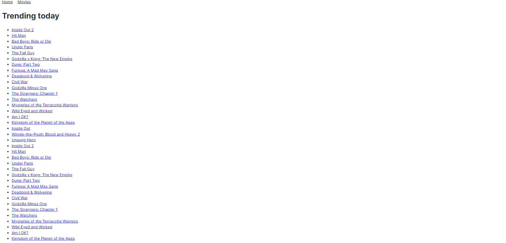
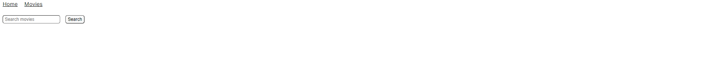

# Task Movies

## Description
The "Task Movies" project is a React application for searching movies using the TMDB API. The application is built with Vite, uses React for the frontend, and integrates with the TMDB API to fetch movie information.

### Functionality
- Display a list of popular movies on the home page.
- Search for movies by keywords.
- Detailed information about a movie, including description, cast, and reviews.
- Navigation between different movie pages.

### Importance of the Task
This task is important because it allows you to learn how to work with external APIs, use routing and components in React, and style applications using CSS modules.

## Contents
- [Installation](#installation)
- [Running](#running)
- [Project Structure](#project-structure)
- [Components](#components)
- [Routes](#routes)
- [Integration with TMDB API](#integration-with-tmdb-api)
- [Examples](#examples)
- [Author](#author)

---

## Installation
To install and run the project, follow these steps:

### Clone the repository
```bash
git clone https://github.com/Vitaliia1109/codingTasks
cd codingTasks
```
### Install dependencies
```bash
npm install
```

---

## Running
To run the project, use the following command:
```bash
npm run dev
```
After that, open the application in your browser at http://localhost:3000

---

## Project Structure
The project has the following structure:

```bash
src/              # Source files
|-- components/   # Components
|-- pages/        # Application pages
|-- App.jsx       # Main application component
|-- index.jsx     # Application entry point
|-- index.css     # Global styles
```
---

## Components
Components are divided into pages and shared components:

#### Pages
- src/pages: Components for application pages.
#### Shared Components
- src/components: Shared components used across different pages.

Each component consists of two files:
- JSX file for the component.
- CSS module file for component styles.

---

## Routes
The application supports the following routes:

- /: Main application page with popular movies.
- /movies: Page for searching movies by keywords.
- /movies/:movieId Page with detailed information about a movie.
- /movies/:movieId/cast: Section with information about the cast of a movie.
- /movies/:movieId/reviews: Section with reviews of a movie.
- /404: Error page if the route is not found.

---

## Integration with TMDB API
To work with the TMDB API, you need to register on the TMDB website and get an API key. For each API request, you need to add an Authorization header with your API key.

Example API Usage
Example request to the API to get a list of popular movies:

```javascript
const url = 'https://api.themoviedb.org/3/trending/movie/week';
const apiKey = 'your_api_key';
const options = {
  headers: {
    Authorization: `Bearer ${apiKey}`
  }
};

axios.get(url, options)
  .then(response => console.log(response.data))
  .catch(error => console.error(error));
```
---

## Examples

- Home Page


- Movies Search Page


- Movie Details Page


---

## Author
Vitaliia Ieromina - Developer who created this project. You can find more of my work on [GitHub](https://github.com/Vitaliia1109).


